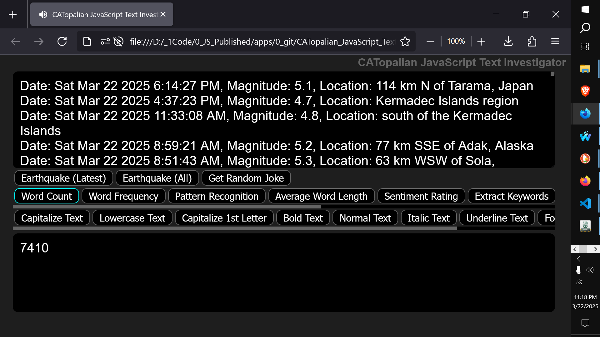

# CATopalian JavaScript Text Investigator
A JavaScript application that enables very deep text analysis. It also gets all Earthquake data from across the world with the push of a button.  

USE APP: https://christopherandrewtopalian.github.io/CATopalian_JavaScript_Text_Investigator/CATopalian_JavaScript_Text_Investigator.html

  

If you enjoy my apps and tutorials please consider buying me a coffee at [paypal.me/keystonermarch](https://www.paypal.com/paypalme/keystonermarch)

---

### How to Download this App
1. Click the green Code Button on this github page
2. Choose Download ZIP
3. Save the Zip File
4. Extract All
5. Double click the HTML file to start the App

---

Happy Scripting :-)

