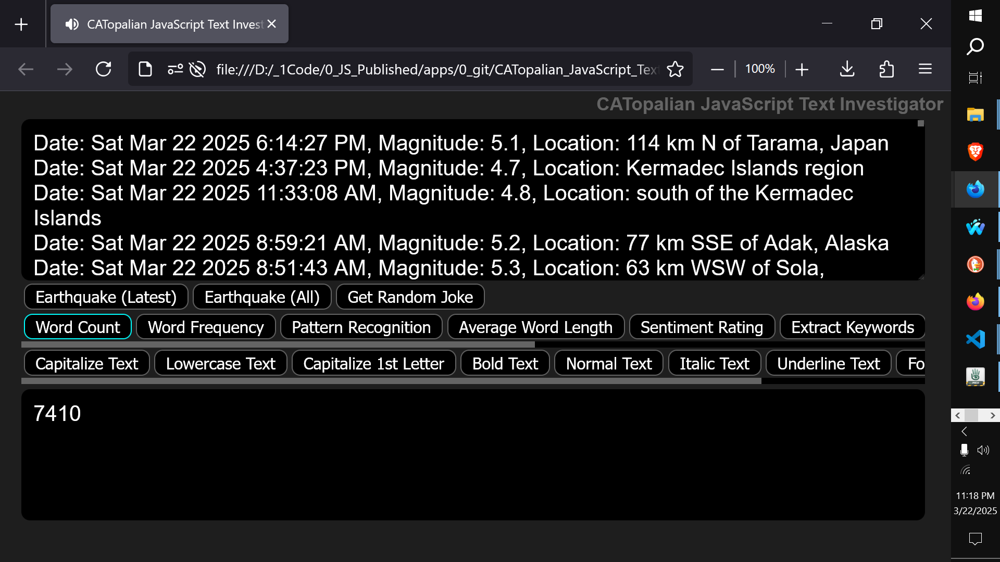

# CATopalian JavaScript Text Investigator
A JavaScript application that enables very deep text analysis. It also gets all Earthquake data from across the world with the push of a button.  

USE APP: https://christopherandrewtopalian.github.io/CATopalian_JavaScript_Text_Investigator/CATopalian_JavaScript_Text_Investigator.html

  

---

### How to Download this App
1. **Click** the green **Code Button** on this github page
2. Choose **Download ZIP**
3. **Save** the **Zip File**
4. **Extract All**
5. **Double click** the **HTML file** to start the App

---

Happy Scripting :-)

---

// Dedicated to God the Father  
// All Rights Reserved Christopher Andrew Topalian Copyright 2000-2026  
// https://github.com/ChristopherTopalian  
// https://github.com/ChristopherAndrewTopalian  
// https://sites.google.com/view/CollegeOfScripting

